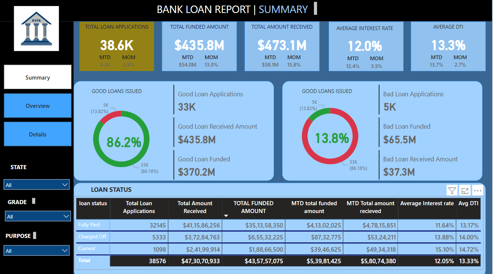
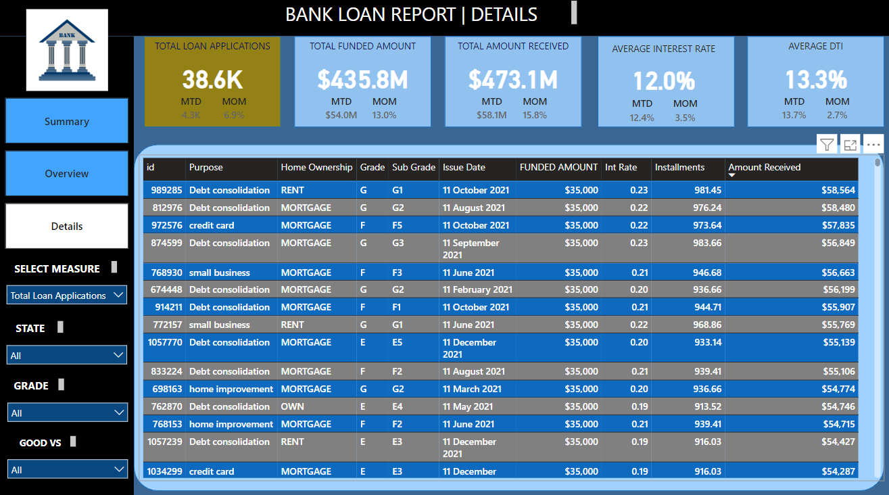

Bank Loan Dashboard
This project is a Bank Loan Dashboard built using Power BI, which provides an interactive report for visualizing and analyzing various loan-related metrics. It helps track loan applications, funded amounts, interest rates, debt-to-income (DTI) ratios, and other relevant details, offering insights into loan performance.

Project Overview
This dashboard visualizes bank loan data, providing insights such as:

Total loan applications
Total funded amounts
Total amount received
Average interest rates
Average debt-to-income ratio (DTI)
Loan details based on various filters like state, grade, and loan status

It is divided into three primary sections:

Summary: A high-level overview of loan applications and funding details with key metrics displayed at the top.

Overview: Monthly loan applications, distribution by state, loan term, and home ownership status.

Details: A detailed view showing individual loan data with adjustable filters for state, grade, and loan status.

Key Features
Interactive Visualizations: The dashboard includes various filters that allow users to view loan data by state, loan grade, loan purpose, home ownership status, and more.
Multiple Measures: Users can toggle between different metrics such as total loan applications, funded amounts, or interest rates.
Visual Insights: Graphs and charts display trends such as loan applications by month, loan term breakdown, and total loan applications by purpose and employment length.
Loan Details: Provides a granular view of individual loans with information like funding amount, interest rate, installments, and amount received.

Filters and Measures
The dashboard supports the following filters and measures:

Select Measure: Allows users to view data based on total loan applications, funded amounts, interest rates, etc.
State: Users can filter data by specific states.
Grade: Filters data by the grade assigned to loans (e.g., G1, F5).
Good vs Bad Loans: Segregates loans into good or bad based on predefined conditions.
Data Insights
1. Summary Tab
Provides overall metrics like total loan applications, total funded amounts, total amount received, and average interest rate.
Breaks down loans into "Good Loans" and "Bad Loans" and shows how many of each were issued.
2. Overview Tab
Displays trends for total loan applications by month.
Geographic breakdown of loan applications by state.
Loan applications by term (36 vs. 60 months).
Insights into loan applications based on employment length and purpose (debt consolidation, credit cards, small business, etc.).
3. Details Tab
Granular loan-level data, including:
Loan purpose (e.g., debt consolidation, credit card, small business)
Home ownership status (Rent, Mortgage, Own)
Loan grades and subgrades
Issue date, funded amount, interest rate, and amount received.
How to Use
Clone the repository:

bash
Copy code
git clone https://github.com/yourusername/bank-loan-dashboard.git
Open the Power BI dashboard: Download Power BI Desktop from Power BI and open the provided .pbix file in this repository.

Explore the Data: Use the available filters on the left to customize the visualizations according to your needs (e.g., select a specific state, grade, or purpose).

Visuals
Summary View:

Overview Tab:

Details Tab:

Technology Stack
Power BI: Used for building the interactive dashboard and visualizations.
Data: Loan data including loan applications, funded amounts, and borrower details.
Future Enhancements
Automated Data Refresh: Integrate with live data sources to automatically refresh the dashboard.
Enhanced Filtering: Add more filters for finer control, such as filtering by loan purpose or borrower credit score.
Predictive Analysis: Implement predictive models to forecast loan performance.

## Screenshots
  
  

